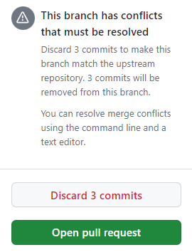

### 📌Github Repository fork

Github의 fork
➡️ 내 이해는 원본Repo에 직접 개발을 반영하기 전 버퍼와 비슷하다고 생각이 든다.

fork시 충돌이 발생하는 경우 어떠한 현상이 발생하는가?
#### case)
원본 Repo가 fork한 Repo의 발전과 별개로 발전한다.

- **Sync fork** ➡️ 원본 Repo의 Branch의 발전을 Fork Repo의 선택된 Branch로 Pull
	- 만약 나의 repo가 fork한 이후 그대로 이면 → 원본 Repo의 commit을 pull 하면 된다.
	- 하지만, 나의 repo가 원본 repo와 다르게 발전했다면...? **충돌이 발생한다.**

📌**우리는 충돌을 어떻게 다룰 것인가?**

- Discard commits
- Open Pull Request

즉, 1) 커밋을 버리거나 2) 별개로 발전한 커밋을 원본 Repo commit에 Pull Request하는 방법으로 해결한다.